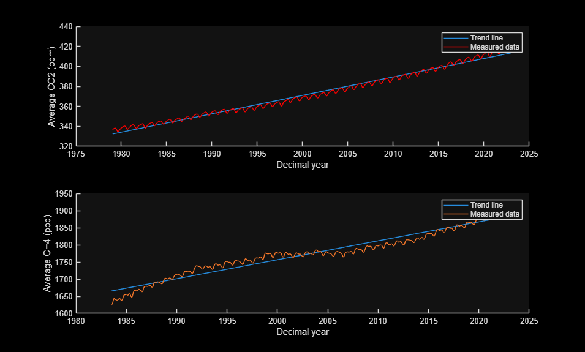
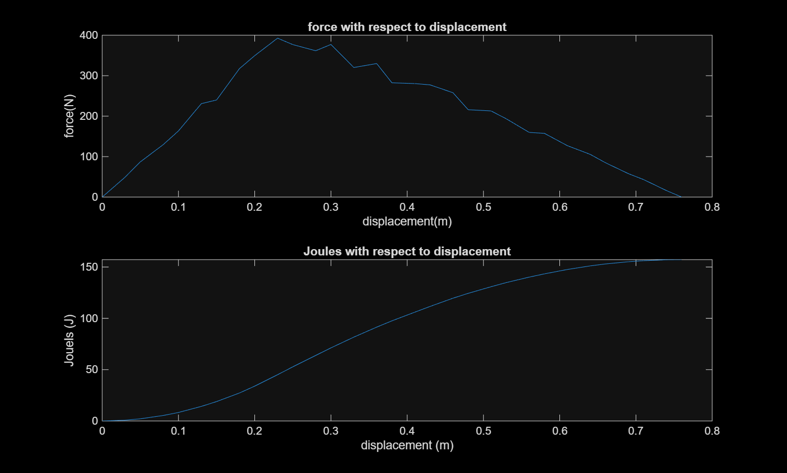

# Purdue ENGR 132 MATLAB 課程作品(NCKU–Purdue,2025 暑期)

[English](README.md)

這是我在 2025 年 7 月 NCKU–Purdue 暑期課程中寫的 MATLAB 程式。課程提供的檔案範本標示為「ENGR 132」。內容包括腳本、繪圖、選擇結構、迴圈、使用者自訂函式與線性回歸的短作業,以及一個團隊期末專題:在 MATLAB 命令視窗中執行的文字版賭場遊戲。

## 重點作品

- **期末專題:文字版賭場**([`final-project/text-based-casino/`](final-project/text-based-casino/))。這是團隊專題。我負責拉霸機、輪盤與「Chinese Roulette」三個遊戲,用 `fprintf`、`clc`、`pause` 做 ASCII 動畫,用 `randi` 產生隨機結果。輪盤盤面存成 12×12 矩陣。[詳見下方](#期末專題文字版賭場)。
- **NOAA 溫室氣體資料線性回歸**([`A11Q3_airPolution.m`](assignments/A11-linear-regression/A11Q3_airPolution.m))。程式用 `polyfit` 對 NOAA GML 全球月平均資料擬合趨勢線,再用迴圈計算 SSE、SST 與 r²。擬合斜率為 CO₂ 1.8434 ppm/年(1979–2023)、CH₄ 5.5272 ppb/年(1983–2023)。
- **由量測力資料計算功**([`A07Q4_conveyorPusher.m`](assignments/A07-loops/A07Q4_conveyorPusher.m))。以 `for` 迴圈用梯形法積分 31 筆力–位移資料,總功為 157.19 J。



*A11 Q3 在 MATLAB R2025a 的輸出(原始繳交時存下的圖)。*



*A07 Q4 在 MATLAB 的輸出(原始繳交時存下的圖)。*

## 內容

| 資料夾 | 檔案 | 功能 | 主要 MATLAB 觀念 |
|---|---|---|---|
| [`assignments/A04-scripts-and-plotting`](assignments/A04-scripts-and-plotting/) | `A04Q1_semimajoraxis.m` | 改寫課程提供的腳本:變數命名改成對應公式符號,三角函數改用角度制。接著做一次 Newton–Raphson 更新,估算太空船軌道的半長軸。輸出:`7098.88314 km`。 | 腳本結構、`sind`/`cosd`、`format longg`、`fprintf` |
| | `A04Q2_plots.m` | 把兩組成本/面積資料畫成三張圖:單一、上下分割、疊圖。 | `figure`、`plot` 線型、`subplot`、`hold on`、座標軸標籤 |
| [`assignments/A05-selection-structures`](assignments/A05-selection-structures/) | `A05Q3_selection.m` | 對使用者輸入的數值套用分段規則。 | `input`、`if`/`elseif`/`else`、關係與邏輯運算子 |
| [`assignments/A07-loops`](assignments/A07-loops/) | `A07Q1_while.m` | 反覆將 A 減半、B 乘三,直到兩個停止條件都成立,並計算迭代次數(7 次)。 | `while`、複合條件、計數器 |
| | `A07Q3_for.m` | 依向量長度累加(結果 `S = 442`)。 | `for`、`length` |
| | `A07Q4_conveyorPusher.m` | 讀取 CSV 中的力–位移資料並積分為累積功,畫出力與功對位移的圖。 | `readmatrix`、`for`、梯形法、`subplot` |
| [`assignments/A08-user-defined-functions`](assignments/A08-user-defined-functions/) | `A08Q2_tankVol.m` | `drain_time` 依水平(0)或垂直(90)擺放,回傳圓柱槽的容積、液體體積與排空時間;其他角度回傳 `-99`。 | 4 個輸入、3 個輸出的自訂函式、`input`/`str2num`、選擇結構 |
| [`assignments/A11-linear-regression`](assignments/A11-linear-regression/) | `A11Q2_wirebonds.m` | 對打線失效率與氯離子濃度做線性擬合(`y = 75.796645x - 1.173225`),印出擬合優度與兩個預測值,並畫出資料與模型。 | 以 `readmatrix` 讀 tab 分隔檔、`polyfit`/`polyval`、迴圈 |
| | `A11Q3_airPolution.m` | 擬合 CO₂ 與 CH₄ 趨勢線,印出 SSE、SST、r²,兩者畫在同一張圖。 | 函式檔、`polyfit`/`polyval`、`subplot`、`legend` |
| [`in-class/enzyme-regression`](in-class/enzyme-regression/) | `EnzymeALR.m` | 對酵素產物濃度時間序列中的 90 列資料做線性擬合,印出 SSE、SST、r² 與 r。 | `readmatrix`、陣列切片、`polyfit`、迴圈 |
| [`quizzes/quiz1`](quizzes/quiz1/) | `NCKU_quiz1_Adam_Fan.m` | 逐元素陣列運算、索引、排序、列平均。 | `.*`、`.^`、`./`、`sort`、轉置後 `mean` |
| [`quizzes/quiz2`](quizzes/quiz2/) | `NCKU_quiz2_Fan.m` | 帶圖例的標記點圖、選擇結構,以及在兩個矩陣上的邏輯搜尋。 | `plot` 標記、`legend`、`if`/`elseif`、搭配邏輯運算的 `find` |
| [`quizzes/quiz3`](quizzes/quiz3/) | `NCKU_quiz3_Fan.m` | 用 `for` 迴圈加總向量(`sum_x = 189`)。 | `for` |
| [`final-project/text-based-casino`](final-project/text-based-casino/) | 25 個檔案 | 團隊賭場遊戲(見下方)。 | 函式互相呼叫、`while` 選單、`switch`、`randi`、ASCII 動畫、用 `readtable`/`writetable` 以 CSV 保存資料 |

只收錄含有我自己程式碼的作業,所以編號不連續。

## 期末專題:文字版賭場

專題簡報的對象是「MATgames Studios」,需求是做出能讓新手邊玩邊學寫程式的 MATLAB 遊戲,而且限定文字介面。第 3 組做了一個賭場,包含四個遊戲和可保存的排行榜。

```matlab
cd final-project/text-based-casino
main_function        % 先輸入玩家名稱,再進入選單
```

選單指令如下:`s` 顯示籌碼,`g1` 進入拉霸機、`g2` 輪盤、`g3` 射龍門、`g4` Chinese Roulette,`r` 顯示排行,`q` 離開。新玩家起始 1000 籌碼。離開時,`main_function` 把 `Name`、`Chips`、`Status` 寫入 `player_records.csv`,依籌碼排序並顯示名次。已破產的名稱不能再使用。

| 遊戲 | 檔案 | 作者(依檔頭) | 程式中的規則 |
|---|---|---|---|
| 選單、紀錄、排行 | `main_function.m` | Andy Gao | 見上方 |
| 拉霸機 | `slot_machine_main.m`、`number_rand_main.m`、`number_rand.m`、`number_one.m` … `number_nine.m` | Adam Fan | 下注至少 100。每一輪的數字取在前一輪數值附近。7-7-7 賠 10 倍,三個相同 8 倍,三個連號 5 倍,其他組合退還 30% 賭注。數字以大型 ASCII 字顯示。 |
| 輪盤 | `roulette_main.m`、`roulette.m`、`test_board.m` | Adam Fan | 選盤面上的一個數字(1–36)。球(`O`)先繞盤三圈再逐漸減速停下。猜中賠 35 倍,沒中退還 30% 賭注。 |
| 射龍門 | `shoot_d_g.m` | 檔案未記錄 | 共五回合。先亮兩張牌,玩家押第三張牌會落在兩張之間。 |
| Chinese Roulette | `chinese_roulette_main.m`、`china_roulette.m`、`number_up.m`、`test_tankman_*.m` | Adam Fan(檔頭列 Edward Li 為協作者) | 全押猜 1–6 的數字,附 ASCII 動畫。猜中籌碼倍增,猜錯籌碼歸零。 |

以下是在 Octave 驗證時輪盤的最後一個畫面(玩家選 5,下注 200):

```text
                O
    1  2  3  4  5  6  7  8  9 10
   36                         11
   35                         12
   34                         13
   33                         14
   32                         15
   31                         16
   30                         17
   29                         18
   28 27 26 25 24 23 22 21 20 19

Jackpot! 3500% reward:7000
```

團隊的技術簡報(未收錄於此)記錄了遊玩前與遊玩後對同學的訪談,並依回饋做了三項修改:

- 因為太容易贏,提高了入場成本;
- 每次輸入指令後重新整理畫面,並加入短暫延遲讓玩家閱讀;
- 保存玩家紀錄,讓回來的玩家保留籌碼,也因此能做出排行榜。

## 執行方式

在 MATLAB 中切換到檔案所在資料夾,輸入腳本或函式名稱即可執行。資料檔都放在讀取它的腳本旁邊。依原始繳交的 publish 輸出,當時使用的是 MATLAB R2025a。

以下檔案不需修改也能在 GNU Octave 10 執行:

- `A04Q1`、`A04Q2`、`A05Q3`、`A07Q1`、`A07Q3`
- 三份小考
- 直接呼叫的四個賭場遊戲,例如 `slot_machine_main(1000)`、`roulette_main(1000)`、`shoot_d_g(1000)`、`chinese_roulette_main(1000)`

其餘需要 MATLAB:

- 呼叫 `readmatrix` 的檔案(A07 Q4、A11 Q2/Q3、酵素課堂練習)會失敗,因為 Octave 10 沒有 `readmatrix`。
- `main_function.m` 用到 `table`、`readtable`、`writetable`,Octave 尚未實作。
- `A08Q2_tankVol.m` 把函式定義寫在腳本程式碼之前,Octave 會把這種檔案當成函式檔。

## 驗證

程式在 Octave 10.3.0 中以預先準備的鍵盤輸入重新執行:

- **上文引用的輸出。** A04 Q1、A07 Q1/Q3、小考 3 印出的數值與表格相同。
- **賭場遊戲。** 四個遊戲以固定亂數種子執行。為了加快速度,多數執行把 `pause` 換成空函式;有一次拉霸機使用真正的 `pause`,結果相同。籌碼變化符合賠率規則:下注 200 時,拉霸 3-3-3 讓 1000 籌碼變成 2400,輪盤猜中讓 1000 變成 7800。
- **需要 `readmatrix` 的檔案。** 這些檔案搭配一個不屬於本 repo 的簡易 `readmatrix` 替代函式執行。A11 Q2 與 A11 Q3 的輸出與原始 MATLAB publish 報告逐位相同。
- **A08 Q2。** 在開頭加上 `1;` 的副本中執行(讓 Octave 視為腳本)。長 10、直徑 4 的水平槽,液高 2、排水口 0.5,得到最大容積 125.663706、液體體積 62.831853、排空時間 99.124399。
- **未執行。** Octave 沒有 `table`,所以 `main_function.m` 沒有執行。

## 作者與來源

- 除非另有註明,程式碼都是我寫的。例外是 `main_function.m`(依檔頭為隊友 Andy Gao)與 `shoot_d_g.m`(未記錄作者)。
- 檔頭註解、`%% SECTION` 段落架構與學術誠信聲明來自課程範本。課程的原始範本檔本身未收錄。
- 資料檔是作業提供的輸入,不是我的作品。`co2_mm_gl.csv` 與 `ch4_mm_gl.csv` 是 NOAA GML 全球月平均資料,檔頭附有 NOAA 的使用說明。
- 未收錄:
  - 課程的 P-code(`.p`)檔與自動產生的題目圖片;
  - 起始程式碼中嵌有學校 ID 的自動產生練習;
  - 依賴隊友檔案的 A09 團隊作業;
  - MATLAB publish 輸出;
  - 草稿測試檔;
  - 團隊技術簡報。
