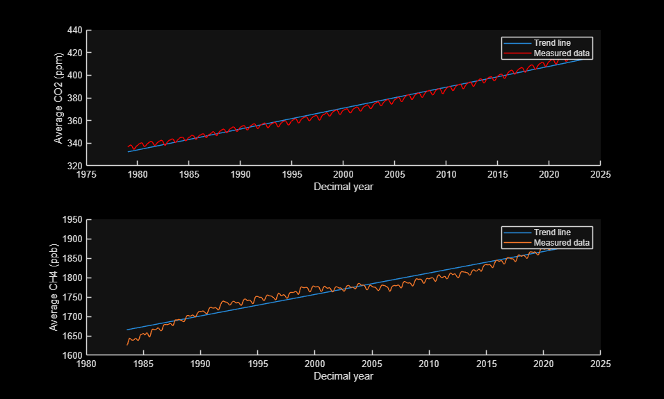
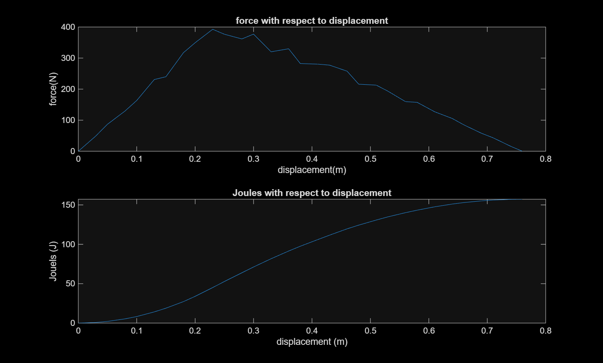

# Purdue ENGR 132(Transforming Ideas to Innovation II)— MATLAB 課程作品(NCKU–Purdue,2025 暑期)


[English](README.md)

NCKU–Purdue 暑期課程(2025 年 7 月)的 MATLAB 作業:腳本、繪圖、選擇結構、迴圈、自訂函式、線性回歸,以及一個團隊期末專題:文字版賭場遊戲。

## 重點作品

- **文字版賭場**([`final-project/text-based-casino/`](final-project/text-based-casino/))。團隊專題。我負責拉霸機、輪盤與 Chinese Roulette:用 `fprintf`、`clc`、`pause` 做 ASCII 動畫,用 `randi` 產生隨機結果,輪盤盤面存成 12×12 矩陣。[詳見下方](#期末專題文字版賭場)。
- **NOAA 溫室氣體資料線性回歸**([`A11Q3_airPolution.m`](assignments/A11-linear-regression/A11Q3_airPolution.m))。用 `polyfit` 對 NOAA GML 全球月平均資料擬合趨勢線,以迴圈計算 SSE、SST 與 r²。斜率:CO₂ 1.8434 ppm/年(1979–2023)、CH₄ 5.5272 ppb/年(1983–2023)。
- **由量測力資料計算功**([`A07Q4_conveyorPusher.m`](assignments/A07-loops/A07Q4_conveyorPusher.m))。以 `for` 迴圈用梯形法積分 31 筆力–位移資料,總功 157.19 J。



*A11 Q3 輸出,原始繳交時存下的圖(MATLAB R2025a)。*



*A07 Q4 輸出,原始繳交時存下的圖。*

## 內容

| 資料夾 | 檔案 | 功能 |
|---|---|---|
| [`assignments/A04-scripts-and-plotting`](assignments/A04-scripts-and-plotting/) | `A04Q1_semimajoraxis.m` | 做一次 Newton–Raphson 更新,估算太空船軌道的半長軸。輸出:`7098.88314 km`。 |
| | `A04Q2_plots.m` | 兩組成本/面積資料畫成三張圖:單一、上下分割、疊圖。 |
| [`assignments/A05-selection-structures`](assignments/A05-selection-structures/) | `A05Q3_selection.m` | 對使用者輸入的數值套用分段規則。 |
| [`assignments/A07-loops`](assignments/A07-loops/) | `A07Q1_while.m` | 反覆將 A 減半、B 乘三,直到兩個停止條件都成立;迭代 7 次。 |
| | `A07Q3_for.m` | 依向量長度累加(`S = 442`)。 |
| | `A07Q4_conveyorPusher.m` | 讀取 CSV 的力–位移資料,積分為累積功並作圖。 |
| [`assignments/A08-user-defined-functions`](assignments/A08-user-defined-functions/) | `A08Q2_tankVol.m` | `drain_time` 依水平(0)或垂直(90)擺放回傳圓柱槽容積、液體體積與排空時間,其他角度回傳 `-99`。 |
| [`assignments/A11-linear-regression`](assignments/A11-linear-regression/) | `A11Q2_wirebonds.m` | 對打線失效率與氯離子濃度做線性擬合(`y = 75.796645x - 1.173225`),印出擬合優度與兩個預測值。 |
| | `A11Q3_airPolution.m` | CO₂ 與 CH₄ 趨勢線,印出 SSE、SST、r²,畫在同一張圖。 |
| [`in-class/enzyme-regression`](in-class/enzyme-regression/) | `EnzymeALR.m` | 對酵素濃度時間序列中的 90 列資料做線性擬合。 |
| [`quizzes/quiz1`](quizzes/quiz1/) | `NCKU_quiz1_Adam_Fan.m` | 逐元素陣列運算、索引、排序、列平均。 |
| [`quizzes/quiz2`](quizzes/quiz2/) | `NCKU_quiz2_Fan.m` | 帶圖例的標記點圖、選擇結構、用 `find` 做邏輯搜尋。 |
| [`quizzes/quiz3`](quizzes/quiz3/) | `NCKU_quiz3_Fan.m` | 用 `for` 迴圈加總(`sum_x = 189`)。 |
| [`final-project/text-based-casino`](final-project/text-based-casino/) | 25 個檔案 | 團隊賭場遊戲(見下方)。 |

## 期末專題:文字版賭場

專題簡報來自「MATgames Studios」,需求是讓新手邊玩邊學的文字介面 MATLAB 遊戲。第 3 組做了一個賭場,包含四個遊戲和可保存的排行榜。

```matlab
cd final-project/text-based-casino
main_function        % 先輸入玩家名稱,再進入選單
```

選單:`s` 顯示籌碼,`g1` 拉霸機、`g2` 輪盤、`g3` 射龍門、`g4` Chinese Roulette,`r` 排行,`q` 離開。新玩家起始 1000 籌碼。離開時,`main_function` 把 `Name`、`Chips`、`Status` 寫入 `player_records.csv`,依籌碼排序並顯示名次。已破產的名稱不能再使用。

| 遊戲 | 檔案 | 作者(依檔頭) | 程式中的規則 |
|---|---|---|---|
| 選單、紀錄、排行 | `main_function.m` | Andy Gao | 見上方 |
| 拉霸機 | `slot_machine_main.m`、`number_rand_main.m`、`number_rand.m`、`number_one.m` … `number_nine.m` | Adam Fan | 下注至少 100。每一輪的數字取在前一輪附近。7-7-7 賠 10 倍,三個相同 8 倍,三個連號 5 倍,其他退還 30% 賭注。 |
| 輪盤 | `roulette_main.m`、`roulette.m`、`test_board.m` | Adam Fan | 選 1–36 的一個數字。球(`O`)繞盤三圈後逐漸減速停下。猜中賠 35 倍,沒中退還 30% 賭注。 |
| 射龍門 | `shoot_d_g.m` | 未記錄 | 共五回合。亮出兩張牌,押第三張落在兩張之間。 |
| Chinese Roulette | `chinese_roulette_main.m`、`china_roulette.m`、`number_up.m`、`test_tankman_*.m` | Adam Fan(檔頭列 Edward Li 為協作者) | 全押猜 1–6 的數字。猜中籌碼倍增,猜錯歸零。 |

Octave 執行時輪盤的最後一個畫面(玩家選 5,下注 200):

```text
                O
    1  2  3  4  5  6  7  8  9 10
   36                         11
   35                         12
   34                         13
   33                         14
   32                         15
   31                         16
   30                         17
   29                         18
   28 27 26 25 24 23 22 21 20 19

Jackpot! 3500% reward:7000
```

依同學訪談回饋做的修改:

- 因為太容易贏,提高入場成本;
- 每次輸入指令後重新整理畫面,並加入短暫延遲;
- 保存玩家紀錄,讓回來的玩家保留籌碼,也因此能做出排行榜。

## 執行方式

在 MATLAB 中切換到檔案所在資料夾,輸入腳本或函式名稱即可。資料檔都放在讀取它的腳本旁邊。原始作業使用 MATLAB R2025a。

以下檔案不需修改即可在 GNU Octave 10 執行:

- `A04Q1`、`A04Q2`、`A05Q3`、`A07Q1`、`A07Q3`
- 三份小考
- 直接呼叫的四個賭場遊戲,例如 `slot_machine_main(1000)`

其餘需要 MATLAB:

- A07 Q4、A11 Q2/Q3 與酵素檔案呼叫 `readmatrix`,Octave 10 沒有。
- `main_function.m` 用到 `table`、`readtable`、`writetable`,Octave 尚未實作。
- `A08Q2_tankVol.m` 把函式定義寫在腳本程式碼之前,Octave 會當成函式檔。

## 驗證

在 Octave 10.3.0 以預先準備的輸入重新執行:

- A04 Q1、A07 Q1/Q3、小考 3 印出的數值與表格相同。
- 四個賭場遊戲以固定亂數種子執行。下注 200 時,拉霸 3-3-3 讓 1000 籌碼變成 2400,輪盤猜中讓 1000 變成 7800。
- A11 Q2 與 A11 Q3 搭配簡易 `readmatrix` 替代函式(不在本 repo)執行,輸出與原始 MATLAB publish 報告逐位相同。
- `main_function.m` 未執行,因為 Octave 沒有 `table`。

## 作者與來源

- 除了 `main_function.m`(依檔頭為 Andy Gao)與 `shoot_d_g.m`(未記錄作者),程式碼都是我寫的。
- 檔頭註解、`%% SECTION` 段落架構與學術誠信聲明來自課程範本。
- `co2_mm_gl.csv` 與 `ch4_mm_gl.csv` 是 NOAA GML 全球月平均資料,為作業提供的輸入。
